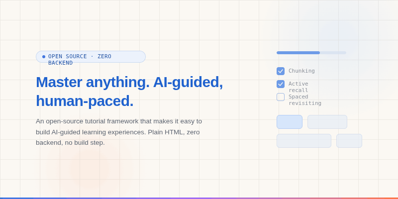

# LearnKit — AI-Powered Tutorial Framework



> A zero-backend, static-file tutorial framework that uses psychology-backed learning design and Claude Code as your personal learning agent.

---

## What Is This?

LearnKit is a framework for building and following structured technical tutorials. It has two modes:

- **Learner mode** — follow an existing tutorial with progress tracking, smart resume, and checklist-based milestones
- **Author mode** — use Claude Code as an agent to create, expand, and improve tutorials on any topic

The framework is intentionally simple: plain HTML, CSS, and JavaScript. No npm, no build step, no server needed. Your progress lives in your browser's localStorage and can be exported as a JSON file to commit to git, share, or move between machines.

This repo ships with a **C++ drone engineering tutorial** as a reference example of what LearnKit can produce. It is not the product — the framework is. New tutorials on any topic can be created from the template in minutes, and the cpp-drone tutorial may be replaced with a better showcase example as the framework matures.

---

## The Learning Philosophy

### Self-improvement loop

When you discover a technique, mental model, or shortcut that makes something click — you can add it back to the tutorial. The `/improve-lesson` skill prompts you for exactly this. Your personal discoveries get embedded as "What worked for me" callouts directly in the section that benefited from them.

This is the compounding part: the tutorial gets smarter as you learn.

---

## Current Features

### For learners

- **3-state progress tracking** — Pending / In Progress / Completed per section, saved in browser localStorage
- **Smart "continue" banner** — resumes the right section with the right verb based on your state
- **Sub-section memory** — remembers which accordion panels you opened; scrolls back to your last position on revisit
- **Checklist persistence** — project milestone checkboxes survive page reloads
- **Copy buttons** — every code block gets an auto-attached Copy button
- **Sidebar navigation** — fixed left nav with live status dots and progress bar, fully mobile-responsive
- **Export / import state** — download your progress as JSON, commit it to git, import on another machine
- **Git-based state sync** — each tutorial's `states/` directory holds named JSON snapshots; check them into your fork to sync across devices
- **Personalization** — first-visit prompt asks your name; greetings and banners address you by name throughout the tutorial
- **Progress sharing via public URL** — one-click share via anonymous GitHub Gist (no account required); paste URL on any device to restore your progress

### For authors (via Claude Code)

- **`/create-tutorial`** — scaffold a complete new tutorial from a conversation
- **`/add-lesson`** — add a new section to an existing tutorial
- **`/improve-lesson`** — improve content of a specific section; includes prompting for personal discoveries
- **`/improve-framework`** — extend or fix the core LearnKit framework itself

---

## Getting Started

### Option A: Follow an existing tutorial (read-only)

```bash
git clone https://github.com/forhad-h/learnkit
cd learnkit
python3 -m http.server 8000
```

Open `http://localhost:8000/tutorials/cpp-drone/` to try the included example tutorial (C++ drone engineering). More tutorials will be added to `tutorials/` as they're created.

Your progress saves automatically in your browser. No account, no login.

### Option B: Create your own tutorial (fork)

1. **Fork this repo** on GitHub — your fork is your tutorial's home
2. Clone your fork locally
3. Open Claude Code in the project directory: `claude` (or open via VS Code extension)
4. Run `/create-tutorial` and answer the prompts
5. Commit your new tutorial files to your fork
6. Enable GitHub Pages on your fork to publish it for free

```bash
git clone https://github.com/<your-github-username>/learnkit
cd learnkit
claude  # opens Claude Code
# In Claude Code: /create-tutorial
```

### Setup walkthrough with Claude Code

After cloning and opening Claude Code (`claude` in the terminal):

```
Step 1: Run /create-tutorial
        Claude will ask you for your topic, audience, sections, and time estimate.
        It creates all the files under tutorials/your-topic/:
        config.js, index.html, pages/, states/

Step 2: Review the generated content
        Open http://localhost:8000/tutorials/your-topic/ and check the dashboard.
        Run /improve-lesson to flesh out any section.

Step 3: Commit your tutorial
        git add .
        git commit -m "add tutorial: Your Topic"
        git push

Step 4: Publish on GitHub Pages
        Go to your repo settings → Pages → Source: main branch / root
        Your tutorial is live at https://<your-github-username>.github.io/learnkit/tutorials/your-topic/
```

---

## Project Structure

```
learnkit/
│
├── core/                             ← shared framework — never tutorial-specific
│   ├── js/framework.js               ← all runtime logic
│   └── css/styles.css                ← design system (136 CSS variables)
│
├── tutorials/
│   ├── template/                     ← copy this to start a new tutorial
│   │   ├── config.js                 ← fill in: title, icon, sections, colors, prereqs
│   │   ├── index.html                ← generic shell — no edits needed
│   │   ├── pages/
│   │   │   └── section-template.html ← boilerplate for a section page
│   │   └── states/
│   │       └── manifest.json
│   │
│   └── cpp-drone/                    ← example tutorial (C++ drone engineering)
│       ├── config.js                 ← reference for what a filled-in config looks like
│       ├── index.html
│       ├── pages/
│       │   ├── section-1.html … section-10.html
│       │   └── settings.html
│       └── states/
│           └── manifest.json
│
└── .claude/
    ├── CLAUDE.md                     ← Claude Code project instructions
    └── commands/
        ├── create-tutorial.md
        ├── add-lesson.md
        ├── improve-lesson.md
        └── improve-framework.md
```

### Key files explained

| File                          | Purpose                                                                                                                                 |
| ----------------------------- | --------------------------------------------------------------------------------------------------------------------------------------- |
| `tutorials/{name}/config.js`  | Tutorial-specific data: title, icon, stateKey, sections list, colors, prerequisites, goal. The only file you edit to define a tutorial. |
| `tutorials/{name}/index.html` | Dashboard shell. Identical across all tutorials — `initDashboard()` populates it from `config.js`.                                      |
| `core/js/framework.js`        | All runtime logic. Reads `window.TUTORIAL_CONFIG`. Shared by every tutorial. Never edit per-tutorial.                                   |
| `core/css/styles.css`         | Design system. 136 CSS custom properties. Monospace fonts. Dark code blocks. Responsive.                                                |
| `pages/settings.html`         | Export/import/clear state. Identical across all tutorials.                                                                              |
| `states/manifest.json`        | Index of named JSON snapshots for git-based sync.                                                                                       |

---

## Portability

LearnKit has zero runtime dependencies by design.

| Concern               | How it's solved                                                                            |
| --------------------- | ------------------------------------------------------------------------------------------ |
| **No server needed**  | Pure static files. Open `index.html` directly or via `python3 -m http.server`.             |
| **No database**       | All state lives in browser localStorage. Exported to JSON files when you want portability. |
| **No build tool**     | No npm, no webpack, no compilation. Edit HTML/JS/CSS and refresh.                          |
| **No account**        | Nothing to log in to. Nothing sent anywhere.                                               |
| **Multi-device sync** | Export state as JSON, commit to your git fork, import on the other device.                 |
| **Deployment**        | GitHub Pages, Netlify, Vercel, any static host, or a USB drive.                            |
| **Backup**            | `git commit` your tutorial's `states/` directory. Your progress is in version control.     |

This is intentional. The target audience is developers who understand files and git. Backend infrastructure would add zero value and introduce a dependency that breaks when it goes down.

---

## Upcoming Features

### Estimated time per section

Each section in `config.js` can declare an estimated duration. Displayed on section cards and in the nav footer. Helps with session planning ("I have 45 minutes — what can I finish?").

### Learning velocity tracking

Track time spent per section (session start → status change to completed). Display average pace vs. estimate. Purely client-side; stored in the state JSON.

### AI-generated review questions

After marking a section completed, a callout appears with 2-3 comprehension questions. These are authored at tutorial-creation time by Claude and embedded directly in the HTML. No API calls at runtime.

---

## For Tutorial Authors: Content Guidelines

When writing or generating section content, apply these patterns:

### Structure every section as

1. **What** — a one-line statement of what this section covers
2. **Why** — why this matters to the learner's goal
3. **How** — the actual content in sub-sections
4. **Verify** — a checklist or code snippet they can run to confirm understanding

### Use the available components

```html
<!-- Accordion sub-section (collapsible, state-remembered) -->
<div class="sub-section" id="s3-1">
  <div class="sub-header" onclick="toggleSub('s3-1')">
    <div class="sub-title">3.1 Your Sub-section Title</div>
    <svg class="sub-chevron" ...>...</svg>
  </div>
  <div class="sub-body">
    <!-- content here -->
  </div>
</div>

<!-- Info callout -->
<div class="callout callout-info">Key concept or context.</div>

<!-- Warning callout -->
<div class="callout callout-warning">Something that trips people up.</div>

<!-- Success callout / personal discovery -->
<div class="callout callout-success">💡 What worked for me: ...</div>

<!-- Checklist (state is persisted) -->
<ul class="checklist">
  <li><input type="checkbox" id="unique-id" /> Task description</li>
</ul>

<!-- Code block (gets Copy button automatically) -->
<pre>your code here</pre>
```

### Tag vocabulary

| Tag                 | Color  | Meaning                                          |
| ------------------- | ------ | ------------------------------------------------ |
| `Read first`        | blue   | Required context before doing anything           |
| `Do first`          | green  | Setup/installation — unblock yourself            |
| `Core skill`        | blue   | Must internalize, will use repeatedly            |
| `Memorize this`     | blue   | Pattern or API worth committing to memory        |
| `Skip if confident` | orange | Optional for those with prior experience         |
| `Core framework`    | purple | Foundational tool/concept for this domain        |
| `Month 3+`          | amber  | Advanced — return to this after basics are solid |
| `Portfolio booster` | purple | Externally visible achievement                   |
| `Track progress`    | green  | Meta — managing your own learning                |
| `Quick reference`   | blue   | Reference material, not linear reading           |

---

## Contributing and the Self-Improvement Loop

This project is designed to get better as people use it.

**Framework improvements** — if you improve the core UX (new component, better mobile behavior, new feature), open a PR or run `/improve-framework` and commit the result.

**Content improvements** — if something in a tutorial section is wrong, unclear, or missing a better example, run `/improve-lesson` and commit. The skill specifically asks what clicked for you personally — those insights are the most valuable additions.

**New tutorials** — run `/create-tutorial`, generate a tutorial on any topic, and add it under `tutorials/`. If it's high quality it may replace `cpp-drone` as the primary showcase example. Anyone can fork the repo and host their own tutorial collection.

---

## Designed for technical people who understand GitHub and files

This is not a consumer product. It assumes:

- You have git installed and know how to fork/clone
- You can run a terminal command
- You understand that files on your machine are real and persistent
- You're comfortable with "your browser is the app"

If that's you, LearnKit gives you something polished consumer tools don't: full ownership, zero subscription, and a learning environment you can extend with AI.

---

## Future Improvements

These features are partially implemented but hidden from the UI until they can be made reliable:

**Share Progress via Public Link (GitHub Gist)**
GitHub's Gist API [now requires authentication](https://docs.github.com/en/rest/gists/gists) even for public gist creation — anonymous POST to `/gists` returns 401. The `shareProgressAsGist()` function in `core/js/framework.js` and the "Share Progress (Public Link)" UI in `pages/settings.html` are fully implemented but hidden. To re-enable: add a GitHub Personal Access Token (PAT) flow in the settings page, or proxy the request through a small serverless function.

**States Directory (git-based sync)**
The `states/manifest.json` workflow lets you sync progress across machines via git. It works correctly when served over HTTP, but requires manual steps (download → rename → commit → push) that are too rough for a general audience. To re-enable: improve the UX (e.g. drag-and-drop into the states folder, auto-detect via a local server helper) and update the workflow steps in `pages/settings.html`.
